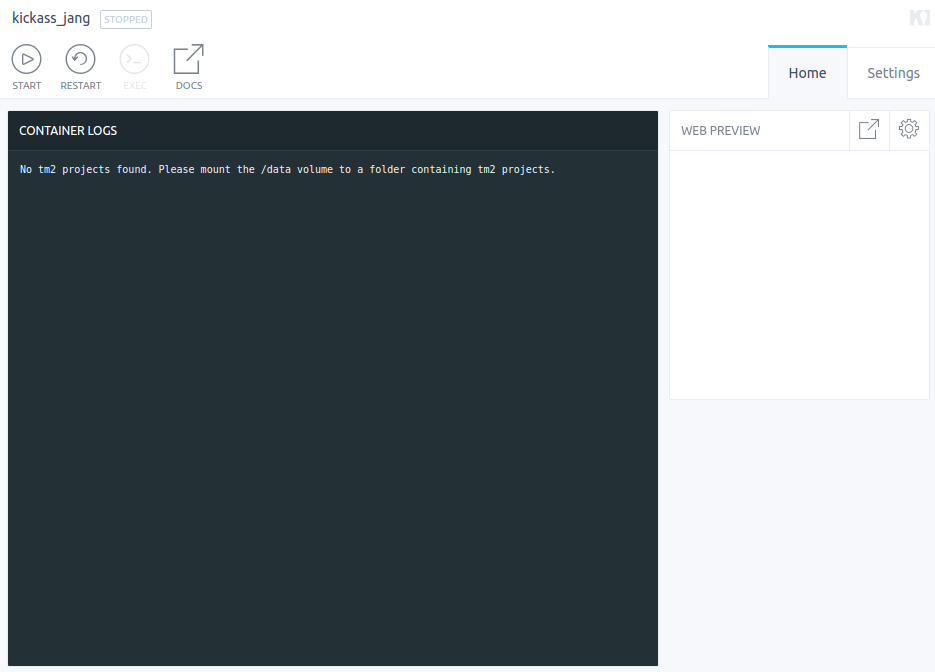
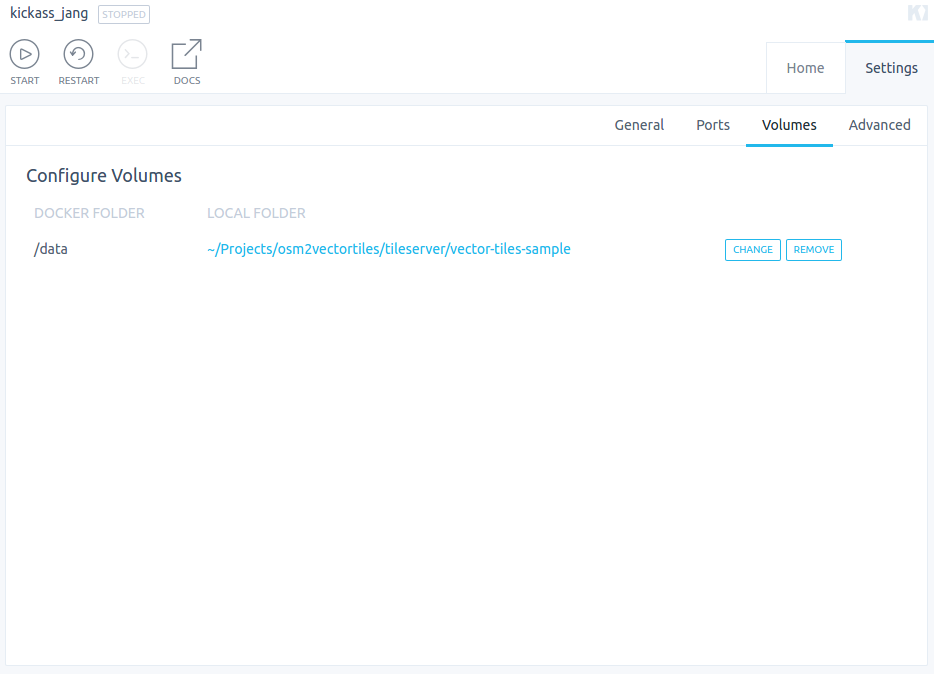

# Tileserver

Render raster data from vector tiles and style projects
on the fly with the help of [tessera](https://github.com/mojodna/tessera).

You plug in your own vector tiles and style projects and get
a raster tile server.

## Kitematic Usage

Start a new container by searching for `lukasmartinelli/tileserver`
(in future `geometalab/tileserver`).
The container will complain about missing `tm2` style projects.



Mount your `mbtiles` files and `tm2` style projects into the `/data` volume.



Now restart the container. You should be up and running serving generated raster tiles.


## Docker Usage

Assuming you are in the folder containing your `mbtiles` files and `tm2` style projects.

```
docker run -p 80:80 -v $(pwd):/data osm2vectortiles/tileserver
```

Visit `localhost:80` to see a [leaflet](http://leafletjs.com/)
map of the rendered raster tiles.

### Vector Tiles Source Configuration

The tileserver is meant to server the tiles from your own
vector tiles. You can develop your stylesheet with a local `tm2source` source
or a `mapbox` source but once you serve the tiles you need to reference a `mbtiles` source.

If you have a `mbtiles` file named the same as your `tm2` project in the data directory,
the server will automatically replace your previous source with a new source.

Given the current folder contains the following files and directories.

```bash
├── countries.tm2
└── countries.mbtiles
```

The original source `mapbox:///klokantech.97cbd1e1` in the `project.yml` will
now be replaced with `mbtiles:///data/countries.mbtiles`.
